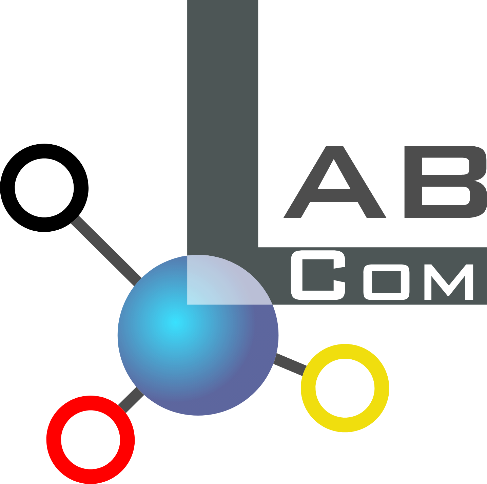
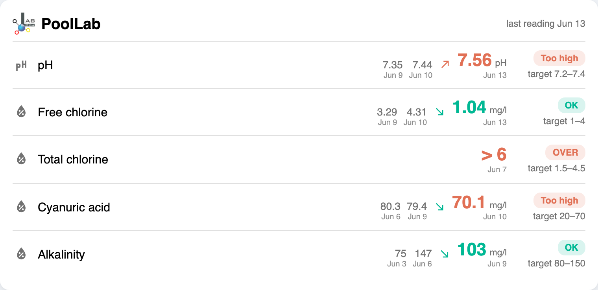

<p align="center"></p>

# PoolLab Card

[](https://github.com/hacs/integration)
[](https://github.com/ADNPolymerase/poollab-card/releases)
[](https://github.com/ADNPolymerase/poollab-card/actions/workflows/hacs.yml)
[](https://www.home-assistant.io)
[](LICENSE)
[](https://buymeacoffee.com/adnpolymerase)
[](https://adnpolymerase.github.io/HA/)

<a href="https://buymeacoffee.com/adnpolymerase" target="_blank"></a>

Multilingual (English, French, German, Spanish, Italian, Dutch, Portuguese — auto-detected from Home Assistant).

A clean Lovelace card for the [PoolLab](https://github.com/Production-Wright/poollab) water analysis integration.
Shows your latest reading for each parameter, the previous measurements, and colors the current value
against its ideal target — with proper handling of **OVER** readings (values above the test's measurable range).

> Not affiliated with PoolLab® / Water-i.d. — independent community card.

> 🇫🇷 [Lire en français](README.fr.md)



## Why this card

The PoolLab integration already exposes, for each parameter, the ideal range (`ideal_low` / `ideal_high`)
and a status — the same targets you set in the PoolLab app. This card reads them automatically, so:

- The current value is colored green (in range) or orange (out of range) with **no threshold config needed**.
- It still lets you **override** the target per parameter if you want.
- It shows the **two previous measurements** with a trend arrow, so you can see whether you're correcting
  in the right direction (e.g. cyanuric acid `80 → 79 → 70` trending down toward range).
- It detects **OVER** readings (the integration reports a huge value when a test is above its measurable
  ceiling) and displays `> max` instead of a meaningless number.

## Features

- One row per parameter: name, real measurement date, previous values, current value, target, status pill
- Current value colored by its target (green / orange), pill shows `OK` / `Trop haut` / `Trop bas` / `OVER`
- Trend arrow comparing the current reading to the previous one (toward the range = green, away = orange)
- Automatic target from the entity, overridable per parameter
- **Threshold cache**: thresholds are persisted in `localStorage` — if a new measurement arrives without configured targets, the last known thresholds are reused automatically
- OVER handling with a built-in table of PoolLab test ceilings (pH 8.4, chlorine 6, CYA 100, TA 200, …)
- Native HA editor (entity picker) + full YAML control

## Installation (HACS)

1. HACS → three dots → **Custom repositories**
2. Add `https://github.com/ADNPolymerase/poollab-card` with category **Dashboard**
3. Install **PoolLab Card**, then hard-refresh your browser (Ctrl+Shift+R / Cmd+Shift+R)

## Manual installation

1. Download `poollab-card.js` from the [latest release](https://github.com/ADNPolymerase/poollab-card/releases)
2. Copy it to `/config/www/`
3. Add the resource: Settings → Dashboards → three dots → Resources → Add
   `/local/poollab-card.js` as a **JavaScript Module**

## Usage

Add the card from the dashboard UI (search "PoolLab") — your `sensor.*_pl_*` entities are auto-detected.
Or in YAML:

```yaml
type: custom:poollab-card
title: PoolLab
measurements: 3        # 1 = latest only, up to 3 (with dates)
show_date: true
show_target: true
entities:
  - sensor.my_pool_pl_ph
  - sensor.my_pool_pl_chlorine_free
  - sensor.my_pool_pl_chlorine_total
  - sensor.my_pool_pl_cyanuric_acid
  - sensor.my_pool_pl_alkalinity
```

Per-parameter overrides use the object form (also editable from the UI editor):

```yaml
entities:
  - entity: sensor.my_pool_pl_ph
    name: pH
    min: 7.0          # override ideal target low (green zone)
    max: 7.4          # override ideal target high
    trend: true       # show/hide the trend arrow for this parameter
    decimals: 2       # number of decimals shown (advanced, YAML only)
  - entity: sensor.my_pool_pl_chlorine_total
    test_max: 6       # value used for the "> max" OVER display (advanced)
```

## Options

| Option | Default | Description |
|---|---|---|
| `title` | PoolLab | Card title |
| `language` | _auto_ | UI language: `en`, `fr`, `de`, `es`, `it`, `nl`, `pt`. Auto-detected from Home Assistant when omitted (English fallback). Also selectable in the editor |
| `translations` | — | Add or override translations from YAML, keyed by language code (see below) |
| `measurements` | `3` | How many measurements to show per parameter: `1` (latest only), `2`, or `3` — previous ones shown with their date |
| `entities` | — | List of PoolLab sensor entities (strings, or objects with overrides) — pick only the parameters you actually use |
| `show_date` | `true` | Show each measurement's real date (`measured_at`) |
| `show_target` | `true` | Show the ideal range under the status pill |

Per-entity (object form, `icon` / `name` / `min` / `max` / `trend` editable in the UI editor): `name`, `icon`, `unit`, `min`, `max`, `trend`, `decimals`, `test_max`.

OVER detection is fixed (the integration reports a very large value when a test exceeds its measurable range); the card shows `> max` using a built-in table of PoolLab test ceilings.

### Editor

The UI editor groups each chosen sensor into its own expandable section (icon, display name, thresholds, trend toggle). Reorder the sensor chips at the top to reorder the displayed rows. Threshold fields are **pre-filled from the values you set in the PoolLab app** (`ideal_low` / `ideal_high`), or from the browser cache when the latest measurement has no configured target. Leave them untouched to follow the app automatically, or change them to set a card-specific override (the override is also saved to the cache and reused on future measurements without targets).

## How targets & colors work

Threshold resolution priority (highest to lowest):

1. **Measurement attributes** (`ideal_low` / `ideal_high` from the PoolLab app) — used automatically, written to the browser cache.
2. **Card config** (`min` / `max` set in the editor or YAML) — used and written to the browser cache.
3. **Browser cache** (`localStorage`) — the last known thresholds, reused when a new measurement has none.
4. **Built-in defaults** (`PL_DEFAULT_TARGETS`) — e.g. pH 7.2–7.6.

This means you only need to fetch thresholds from the PoolLab cloud once: after that, they are remembered locally and reused for all subsequent measurements, even if the app returns no target.

Other rules:
- Value is green when within the range, orange when below or above it.
- When the integration reports an OVER value, the card shows `> max` where `max`
  is the test's measurable ceiling (`test_max` override, else a built-in PoolLab lookup, else the target high).
- The trend arrow compares the current reading to the previous one. When out of range, it's green if the
  value moved toward the target midpoint, orange if it moved away.

## Languages

The card is multilingual (English, French, German, Spanish, Italian, Dutch, Portuguese) and follows your
Home Assistant language automatically, with English as a fallback. Force a language with `language:` or pick
one in the editor.

You can add a new language or override any string from YAML — no PR needed — via `translations`, keyed by
language code:

```yaml
type: custom:poollab-card
language: sv
translations:
  sv:
    last: senaste mätning
    target: mål
    high: För högt
    low: För lågt
    ok: OK
    p:
      "chlorine free": Fritt klor
```

Reviewed translation contributions are very welcome. Thanks to [@hmmbob](https://github.com/hmmbob) for the
Dutch translation and the YAML `translations` override idea.

## License

[MIT](LICENSE)
